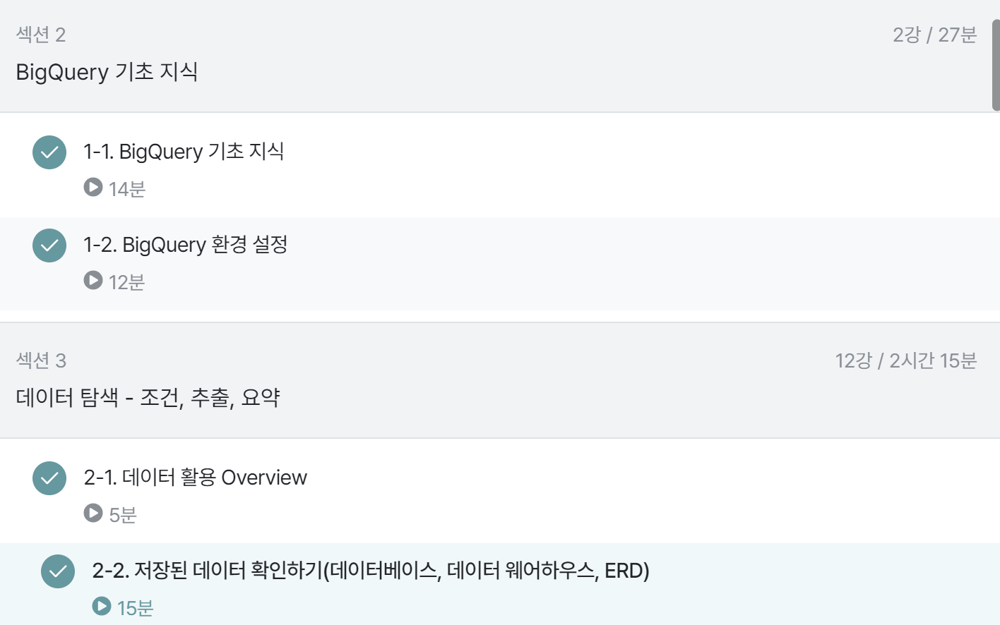

# 1-1. BigQuery 기초지식
**데이터의 저장 형태**

- Database: 데이터의 저장소

- Table: 데이터가 저장된 공간

**저장되는 장소**

- MySQL,Orcale,PostgreSQL: 회사별로 사용하느 데이터베이스가 다름
- 다음의 데이터베이스들은 공통적으로 OLTP(Online Transaction Processing)
- OLTP: 보류, 중간 상태가 없고, 데이터가 무결
- OLDP는 분석을 위해 만든 데이터베이스가 아니라서 쿼리 속도가 느릴 수 있다.

**데이터의 형태**

- 테이블은 컬럼과 로우 구조
- 테이블은 엑셀이나 스프레드시트와 유사

**OLAP와 데이터 웨어하우스(DW)**

- OLAP: 분석을 위한 기능 제공
- 데이터 웨어하우스: 데이터를 한 곳에 모아서 저장
- 웹,파일,API등의 데이터

**BigQuery**

- SQL을 사용해 쉽게 데이터 추출
- OLAP를 사용하므로 속도가 빠름
- firebase나 google Analytics4의 데이터를 쉽게 추출하여 웹 개발에 유리
- 구글에서 인프라를 관리하기 떄문에 서버를 띄울 필요가 없음(DW사용해서)
- 쏘카, 당근, 컬리 등에서 사용
- 적은 비용으로 진행

# 1-2. BigQuery 환경설정

**빅쿼리의 구성요소**

1)프로젝트
- 하나의 건물, 건물 안에는 여러 가지 창고
- 하나의 프로젝트에 여러 데이터셋이 존재

2)데이터셋
- 프로젝트에 있는 창고, 각 창고 공간에 데이터를 저장

3)테이블
- 창고에 있는 선반
- 행과열로 이루어진 데이터들이 저장

# 2-1. 데이터 활용 Overview

**데이터의 활용**
- 조건, 추출, 변환, 요약
- 데이터 탐색 --> 데이터 결과 검증 --> 피드백
- 문제 정의가 중요함(MECE)
- 지표를 잘 정의하기

# 2-2. 저장된 데이터 확인하기

- 데이터를 추출하기 전에 데이터가 어떻게 저장되어 있는지 확인해야함
-ERD: 데이터베이스의 구조를 한눈에 알아보기 위해 사용
- ERD가 없다면 직접 데이터베이스를 보면서 탐색하기
- 데이터 예씨: 유저 테이블, 배송 테이블, 물건 테이블, 웹/로그 데이터, 공공 데이터, 서드파티 데이터

