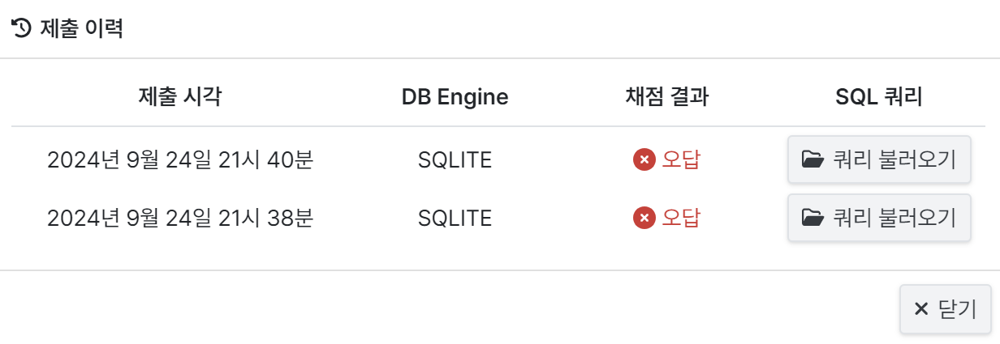
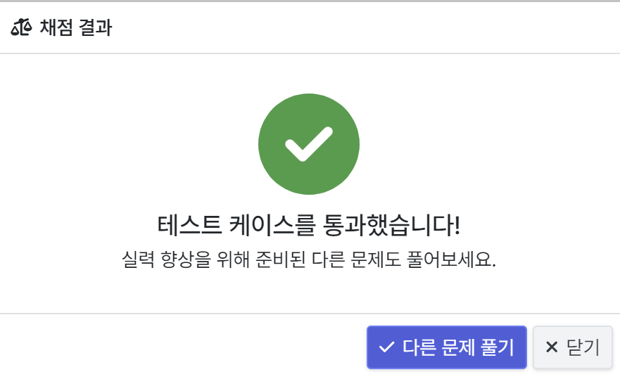
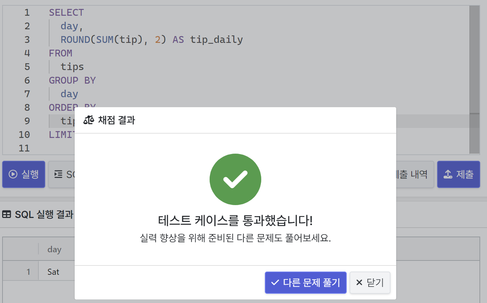

# 2-3 데이터 탐색
- *: 모든 칼럼 출력
- *except: 제외할 칼럼 지정
- select는 원하는 칼럼 추출
- from은 어떤 테이블인지
- where은 칼럼의 조건
- as는 별칭을 줄 때 사용
- 가독성을 위해서 tab 사용
- ;은 하나의 쿼리가 끝났다는 것을 의미
- select from where 순서

# 2-5. 데이터 집계
- group by: 같은 값끼리 모아 그룹화
- select에서 집계함수를 정의해야 함
- distinct: 중복 제거(고유값의 수)
- 그룹화는 시간의 흐름, 연령대별, 특정 제품 타입별 집계에 사용
- where은 table에 바로 조건 적용
- having은 그룹바이 한 후의 조건
- 집계한 후 as로 이름 정의해주는게 좋음
- Order by는 정렬(디폴트는 오름차순), 가장 마지막에 표시
- limit는 로우 수 제한

# 문제풀이
## 1. 우리 플랫폼에 정착한 판매자 
```sql
SELECT 
  seller_id,
  COUNT(DISTINCT order_id) AS orders
FROM 
  olist_order_items_dataset
GROUP BY 
  seller_id 
HAVING 
  orders >= 100;
```
- distinct를 사용해야한다는 사실을 유의해야 하는데, 한 주문에 중복된 상품들이 포함될 수 있기 때문에 같은 주문번호는 하나로 쳐야한다.
- distinct를 생각하지 못해서 오답


## 2. 몇 분이서 오셨어요?
```sql
SELECT  
  *
FROM 
  tips
WHERE 
  size %2 = 1
  ```


## 3. 최고의 근무일을 찾아라
```sql
SELECT 
  day,
  ROUND(SUM(tip), 2) AS tip_daily
FROM 
  tips
GROUP BY 
  day
ORDER BY 
  tip_daily DESC
LIMIT 1;
```
- 가장 높은 값을 추출하기 위해 order by와 limit를 사용하는 것이 핵심
- round는 괄호 밖에 있어야 함



