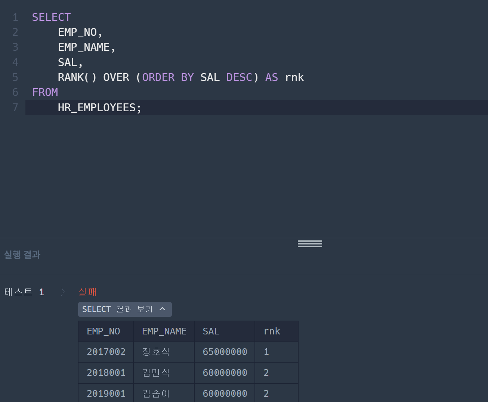
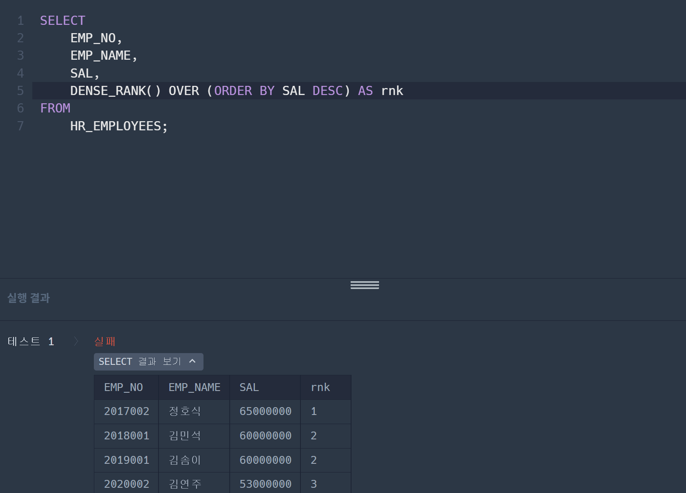
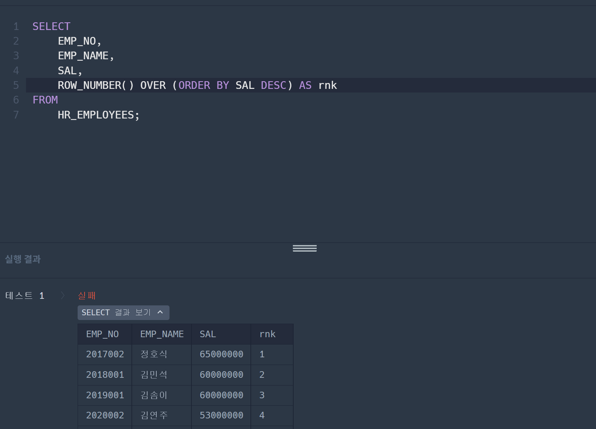

# 1. 틀린코드 이유 분석

**틀린코드**
```
SELECT *
FROM (SELECT FOOD_TYPE, REST_ID, REST_NAME, MAX(FAVORITES) AS FAVORITES
      FROM REST_INFO
      GROUP BY FOOD_TYPE
      ORDER BY FOOD_TYPE DESC)
```

- group by에서 food_type별로 출력하고자 할 때 집계되지 않은 REST_id나 RREST_NAME은 출력하기 어려운데 이 말의 뜻은 각 FOOD_TYPE 별로 여러 개의 식당이 있기 때문에 이를 선택하는 것에 혼란을 줄 수 있다.

- 또한 MAX함수와 같이 SELECT행에 포함되어 있어서 혼란을 줄 수 있다.

```
SELECT FOOD_TYPE, REST_ID, REST_NAME, FAVORITES
FROM REST_INFO
WHERE (FOOD_TYPE, FAVORITES) IN (
    SELECT FOOD_TYPE, MAX(FAVORITES)
    FROM REST_INFO
    GROUP BY FOOD_TYPE
)
ORDER BY FOOD_TYPE DESC;
```

-정답 코드에서는 서브쿼리를 사용하여 FOOD_TYPE에 대해 최대 FAVORITES 값을 찾은 후 , 필터링한 데이터에 기반하여 ID와 NAME을 순차적으로 출력하기 때문에 오류가 없다.

# 2. 개선된 쿼리 학습
```
WITH RankedRest AS (
    SELECT FOOD_TYPE, REST_ID, REST_NAME, FAVORITES,
           ROW_NUMBER() OVER (PARTITION BY FOOD_TYPE ORDER BY FAVORITES DESC, REST_ID) AS rnk
    FROM REST_INFO
)
SELECT FOOD_TYPE, REST_ID, REST_NAME, FAVORITES
FROM RankedRest
WHERE rnk = 1
ORDER BY FOOD_TYPE DESC;
```

1.
WITH 구문을 활용하여 중간 결과를 저장하는 집합을 만들었음

2.
WITH 구문 안에 ROW_NUMBER을 활용하여 FOOD_TYPE별로 FAVORITES가 높은 순선대로 순번을 매겼음

3. 
마지막으로 ROW_NUMBER의 순번을 토대로 RNK가 1인 피쳐를 찾아서 FOOD_TYPE별로 정렬했음

-장점1: 이전 코드에서는 서브쿼리를 사용하여 MAX함수를 통해 FAVORITES이 가장 높은 피쳐를 찾았다면 개선된 코드는 ROW_NUMBER을 통한 단순한 정렬을 통해 원하는 피쳐를 찾을 수 있었다. 

-장점2: FAVORITES이 가장 높은 피쳐 뿐만 아니라 두번째로 높은 값, 세번 째로 높은 값들도 RNK를 통해 선택할 수 있으므로 코드의 사용범위가 더 넓다.

# 3. 조건에 맞는 사원 정보 조회하기

**RANK**

- 사진에서 볼 수 있듯이 동일한 값이 있으면 다음 값이 4로 건너뛰어지는 특징이 있다.

**DENSE_RANK

- 결과에서 볼 수 있듯이 중복된 값이 있더라도 다음값을 건너뛰지 않고 3으로 나오는 것을 알 수 있다.

**ROW_NUMBER

- 동일한 값이라도 순위를 다르게 매겨서 동일한 순위가 없도록 함