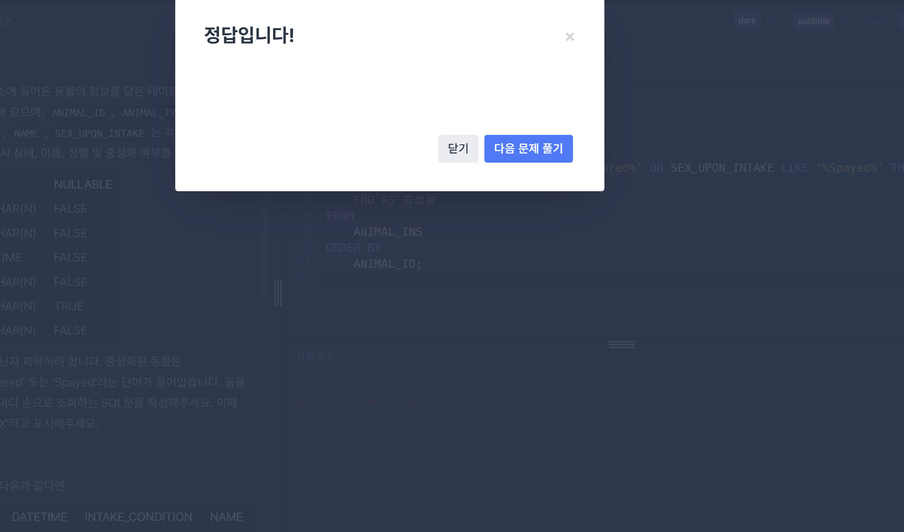

# 1-1. Null 처리하기(IFNULL)

```sql
SELECT 
    ANIMAL_TYPE,
    IFNULL(NAME, 'No name') AS NAME,
    SEX_UPON_INTAKE
FROM 
    ANIMAL_INS
ORDER BY 
    ANIMAL_ID;
```

- IFNULL을 사용했을 때, Name컬럼의 값이 결측인 NULL인 경우 No name으로 표시하고 아닌 경우에는 name값을 그대로 사용하여 문제를 해결할 수 있다.

# 1-2. Null 처리하기(Case When)

```sql
SELECT 
    ANIMAL_TYPE,
    CASE 
        WHEN NAME IS NULL THEN 'No name'
        ELSE NAME
    END AS NAME,
    SEX_UPON_INTAKE
FROM 
    ANIMAL_INS
ORDER BY 
    ANIMAL_ID;
```

- Case를 사용한 경우 IFNULL과 동일하게 name값이 null인 경우 no name, name 값이 있는 경우 그대로 사용하는데 case when은 ifnull보다 코드가 길지만 더 복잡한 조건을 처리할 수 있다.(조건이 여려개인 경우)

# 2-1. 중성화 여부 파악하기

```sql
SELECT 
    ANIMAL_ID,
    NAME,
    CASE
        WHEN SEX_UPON_INTAKE LIKE '%Neutered%' OR SEX_UPON_INTAKE LIKE '%Spayed%' THEN 'O'
        ELSE 'X'
    END AS 중성화
FROM 
    ANIMAL_INS
ORDER BY 
    ANIMAL_ID;
```
- like함수를 사용해서 새로운 칼럼을 만드는데 만약 sex_upon_intake칼럼이 neutered이거나 spayed라면 O를 출력하고 아닌 경우에는 x를 출력한 후 이 칼럼을 중성화라는 칼럼으로 지정하여 문제를 해결 할 수 있다.



# 2-2. 중성화 여부 파악하기(QnA)

```sql
SELECT animal_id, name,
       if (sex_upon_intake like '%Neutered%' or '%Spayed%', 'O' , 'X') as '중성화'
from animal_ins
order by 1
```
- 이 코드가 틀린 이유는 or을 사용 때문인데, like가 Neutered까지만 커버하고 spayed에는 like가 적용되지 않기 때문이다.

- 코드를 수정하자면 다음과 같다.

```sql
SELECT 
    ANIMAL_ID, 
    NAME,
    IF (
        SEX_UPON_INTAKE LIKE '%NEUTERED%' OR SEX_UPON_INTAKE LIKE '%SPAYED%', 
        'O', 
        'X'
    ) AS '중성화'
FROM 
    ANIMAL_INS
ORDER BY 
    ANIMAL_ID;
```
