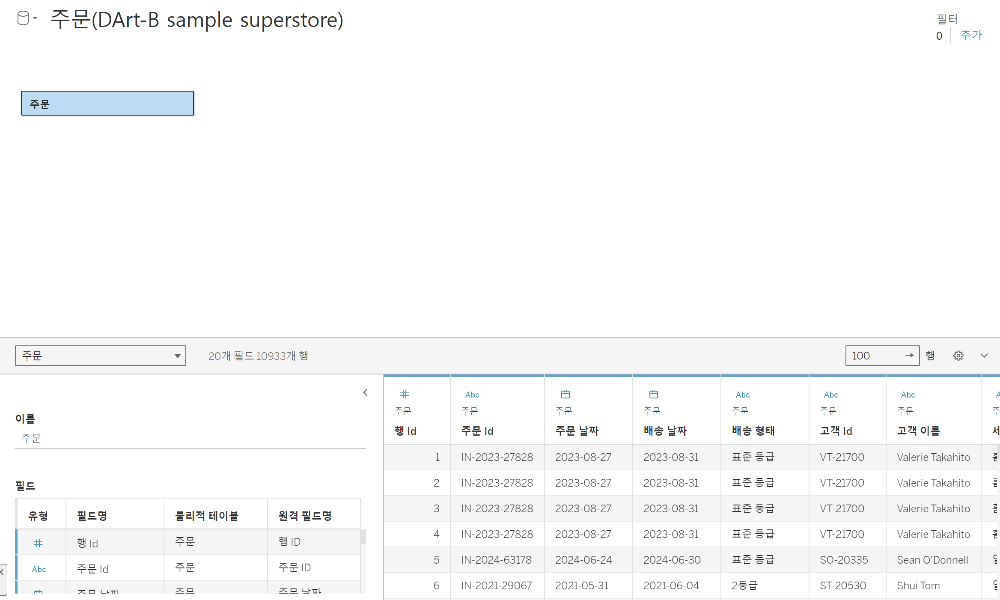
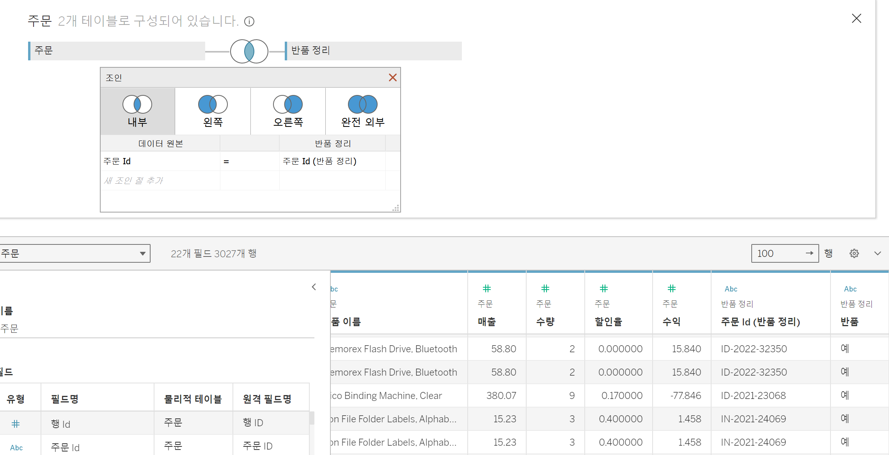
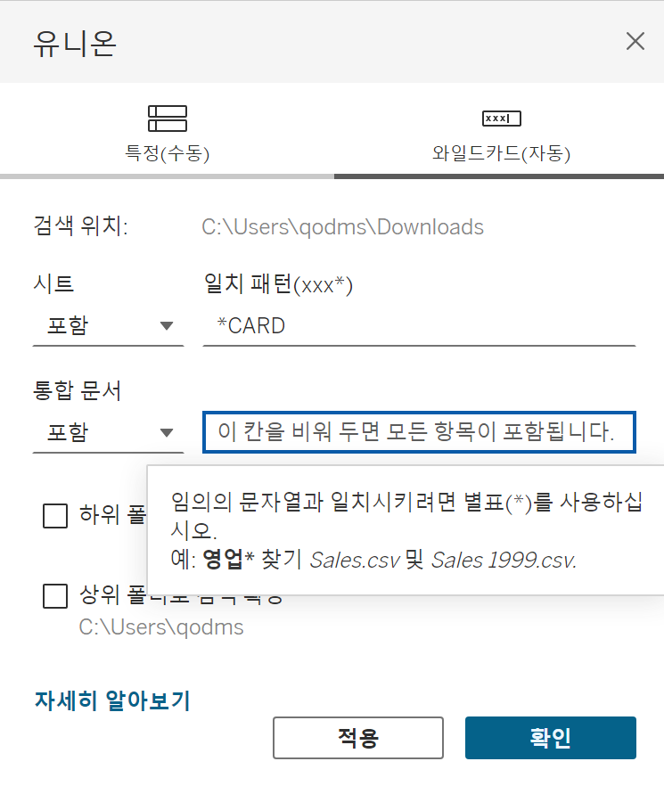

# First Study Week

- 1강: [태블로설치](#1강-태블로설치)

- 2강: [데이터연결](#2강-데이터연결)

- 3강: [데이터연결과 데이터유형](#3강-데이터연결과-데이터유형)

- 4강: [데이터결합과 관계](#4강-데이터결합과-관계)

- 5강 : [데이터결합과 조인](#5-데이터결합과-조인)

- 6강: [데이터결합 혼합](#6강-데이터결합-혼합)

- 7강: [데이터결합과 유니온](#7강-데이터-결합과-유니온)

- 8강: [라이브 및 추출](#8강-라이브-및-추출)

- 9강: [데이터형식](#9강-데이터형식)

- 문제1 : [문제1](#문제-1)

- 문제2 : [문제2](#문제-2)

- 참고자료 : [참고자료](#참고-자료)


## Study Schedule

| 강의 범위     | 강의 이수 여부 | 링크                                                                                                        |
|--------------|---------|-----------------------------------------------------------------------------------------------------------|
| 1~9강        |  ✅      | [링크](https://youtu.be/3ovkUe-TP1w?si=CRjj99Qm300unSWt)       |
| 10~19강      | 🍽️      | [링크](https://www.youtube.com/watch?v=AXkaUrJs-Ko&list=PL87tgIIryGsa5vdz6MsaOEF8PK-YqK3fz&index=75)       |
| 20~29강      | 🍽️      | [링크](https://www.youtube.com/watch?v=AXkaUrJs-Ko&list=PL87tgIIryGsa5vdz6MsaOEF8PK-YqK3fz&index=65)       |
| 30~39강      | 🍽️      | [링크](https://www.youtube.com/watch?v=e6J0Ljd6h44&list=PL87tgIIryGsa5vdz6MsaOEF8PK-YqK3fz&index=55)       |
| 40~49강      | 🍽️      | [링크](https://www.youtube.com/watch?v=AXkaUrJs-Ko&list=PL87tgIIryGsa5vdz6MsaOEF8PK-YqK3fz&index=45)       |
| 50~59강      | 🍽️      | [링크](https://www.youtube.com/watch?v=AXkaUrJs-Ko&list=PL87tgIIryGsa5vdz6MsaOEF8PK-YqK3fz&index=35)       |
| 60~69강      | 🍽️      | [링크](https://www.youtube.com/watch?v=AXkaUrJs-Ko&list=PL87tgIIryGsa5vdz6MsaOEF8PK-YqK3fz&index=25)       |
| 70~79강      | 🍽️      | [링크](https://www.youtube.com/watch?v=AXkaUrJs-Ko&list=PL87tgIIryGsa5vdz6MsaOEF8PK-YqK3fz&index=15)       |
| 80~89강      | 🍽️      | [링크](https://www.youtube.com/watch?v=AXkaUrJs-Ko&list=PL87tgIIryGsa5vdz6MsaOEF8PK-YqK3fz&index=5)        |


<!-- 여기까진 그대로 둬 주세요-->


## 1강. 태블로설치


<!-- 태블로 Desktop은 유료 혹은 사용자 인증이 되어야 하므로, 사용 경험이 없으시다면 우선 Tableau Public으로 학습하는 것을 권장드립니다. -->


## 2강. 태블로연결


> **🧞‍♀️ 데이터 해석기는 어떤 경우 사용하나요?**

```
데이터 해석기를 지원하는 커넥터에서 병합된 셀, 메모, 바닥글, 빈 셀 등을 감지하고 이를 무시하여 집합의 실제 필드와 값을 식별할 수 있게 하는 기능이다. 데이터 관리 시 Tableau가 읽기 쉽도록 해야하나 그렇지 않는 경우 데이터 해석기 기능을 사용한다.
```


> **🧞‍♀️ 깃허브 assignment 폴더의 DArt-B Sample Store.xls 파일을 다운받고 시트 중 '주문' 시트를 불러와주세요.**


<!-- 캡쳐 파일을 첨부해주세요! 캡쳐하는 법은 깃허브 강의 영상에 있습니다 (폴더 생성 후 폴더 안에 이미지 넣기 + 불러오기) -->


<!-- 문제와 문제 풀이가 모두 위 DArt-B Sample Store.xls 파일을 기반으로 제시되므로, 해당 엑셀파일을 사용하셔야 혼동이 없습니다. -->


## 3강. 데이터연결과 데이터 유형


> **🧞‍♀️ 라이브와 추출의 차이가 무엇인가요? 어떤 경우 사용하나요?**


```
라이브는 태블로가 데이터에 직접 연결하는 형태이므로 데이터 원본에 변화가 생기면 시트에서 작업한 내용에 바료 영향을 미치게 된다. 또한 데이터 양이 많아지면 처리 속도 및 성능이 저하된다. 추출은 현재 데이터 원본의 상태를 하이퍼 형태로 저장하는 것으로 오프라인 상태에서도 추출파일을 가지고 있다면 작업이 가능하며 라이브에 비해 처리속도가 빠른 장점이 있다. 데이터 원본이 변경됐다면 새로고침을 통해 업데이트 할 수 있다. 라이브와 추출은 사용하고자 하는 데이터 원본의 저장위치 및 데이터 크기 온오프라인과 같은 환경을 고려하여 선택하면 된다.
```


## 4강. 데이터결합과 관계

<!-- 데이터 결합과 관계에 대해 알게 된 점을 자유로이 적어보세요.--> 관계로 결합된 데이터는 조인으로 결합된 데이터보다 동적이고 유연하게 연결된다.

> **🧞‍♀️ 어떤 경우에 관계를, 어떤 경우에 조인을 사용하나요?**

```
관계로 결합된 테이블은 각각 독립적으로 데이터 원본을 사용할 수 있는데 데이터를 조금 더 유연하게 사용할 수 있다. 또한 조인에서 생길 수 있는 데이터 중복 문제에서 벗어날 수 있게 한다. 반면 조인은 제어 혹은 의도적인 필터링, 복제를 위해 사용된다.
```


## 5강. 데이터결합과 조인

<!-- 데이터 결합과 조인에 대해 알게 된 점을 적고, 아래 질문에 답해보세요 :) -->

주문 중 '반품된' 주문만을 가지고 분석을 진행하려고 합니다.

> **🧞‍♀️ 해당 목적 달성을 위해서 Sample store 데이터셋의 어떤 시트를 조인(혹은 릴레이션)해야 할까요? 조인키는 무엇인지, (inner, outer, left, right) 조인 유형은 무엇일지 논의해주세요.** 데이터셋에서 주문 시트와 반품정리 시트를 조인해야하며 반품된 주문만을 가지고 분석을 해야하기 때문에 inner 조인이나 right조인을 해야합니다. right조인을 한다면 반품된 데이터만 추출되지만 기존의 주문시트와 겹치지 않은 부분이 있어 null값이 생길 수 있습니다.(실제로 행의 수가 1개 더 많음)

데이터를 조인한 데이터 원본 창의 캡쳐를 첨부해주세요.
몇 개의 주문이 반품되었다고 표시되나요?3027개(inner)

<!-- 캡쳐 이미지를 첨부해주세요 -->


## 6강. 데이터결합 혼합

<!-- 데이터결합 및 혼합에 대해 알게 된 점을 적어주세요 --> 관계로 데이터 원본을 결합할 수 있기 때문에 비슷한 기능인 혼합은 잘 사용되고 있지 않다. 하지만 혼합을 통해서 시각화하는 것도 때에 따라 유용한 방법일 수도 있을 것 같다.


## 7강. 데이터 결합과 유니온

<!-- 유니온에 대해 알게 된 점을 적어주세요 -->
관계,조인,혼합은 데이터의 열을 추가하는 방법이라면 유니온은 행을 결합하는 방법이다.
> **🧞‍♀️ 유니온을 사용하기 위한 전제 조건은 무엇인가요?** 데이터의 테이블 구조가 동일해야 하는데 각 테이블의 필드 수가 같고, 관련 필드의 필드 이름과 데이터 유형이 일치해야 한다.


## 8강. 라이브와 추출

<!-- 라이브와 추출에 대해 알게 된 점을 적어주세요 -->

> **🧞‍♀️ 라이브와 추출 방법의 차이가 무엇인가요? 어떤 경우에 추출을 사용하면 좋을까요?** 라이브와 추출의 가장 큰 차이점은 데이터의 실시간 업데이트이다.라이브는 데이터 원본의 변경사항이 바로 테블로에 반영되어 실시간으로 정보가 업데이트 되지만 추출데이터는 매번 추출을 눌러주어야 업데이트가 된다. 라이브의 경우에는 데이터 베이스에서 모든 과정이 처리되기 때문에 데이터 베이스의 성능에 따라 속도가 달라지지만, 추출의 경우 작업 시에 데이터 원본이 테블로 서버로 복사된다.추출은 집계에 최적화되고, 시스템 메모리에 로드되어 시각화를 빠르게 호출하는 방법으로 대규모 데이터, 필터, 계산 등이 포함된 데이터에 적합하다.병원에서 실시간으로 데이터를 확인해야 할 경우에는 라이브 방식이 낫지만 주간 추세를 보고자 하는 경우에는 추출방식이 더 낫다.


**참고자료 : 온프레미스 데이터란?**

기업이나 조직이 자체적으로 보유한 물리적 서버나 데이터 센터 내에서 직접 관리하는 데이터로, 조직 내의 하나 이상 서버에서 통제됩니다. 본 서버들은 기업의 데이터센터나 물리적 위치에 설치되어 있으며, 네트워크를 통해 해당 데이터에 접근하고 관리할 수 있습니다.


## 9강. 데이터형식

<!-- 데이터형식에 대해 알게 된 점을 적어주세요 -->데이터 형식에는 텍스트, 날짜, 날짜 및 시간값, 숫자, 부울, 지리적 값이 있는데 각각의 아이콘을 통해 그 형식을 알 수 있으며 각각의 데이터에 걸맞는 형식을 선택해 주어야 데이터 조인을 하거나 시각화를 할 때 더 편리하고 오류가 생기지 않는다.


## 문제 1.

용웅이는 아래 사진과 같이 2024년 3월부터 7월까지의 지하철 승하차 이용객 데이터를 가지고 있습니다. 월별로 데이터셋이 나누어진 상태며, 용웅이는 해당 데이터셋 5개 모두를 한 번에 시각화하려 합니다. 필드 값(컬럼)의 이름, 데이터 유형, 개수는 모두 같습니다.


 이때, '조인, 관계, 혼합, 유니온' 중 본 목적에 적합한 결합 방법은 무엇인가요? 하나씩 드래그하지 않고, 와일드카드를 이용해 모든 데이터를 빠르게 결합해보세요.

<!-- 텍스트 및 이미지로 문제 풀이 과정을 기술해주세요 --> 데이터의 행끼리 합치는 것이기 때문에 유니온을 사용하는 것이 가장 적합하다. 다섯개의 테이블을 합쳐야 하고 각 테이블의 이름에 CARD가 포함되기 때문에 하이브리드 창에서 일치패턴테 *CARD라고 입력하고 적용하면 된다.



## 문제 2.

상원이는 태블로를 사용하여 회사의 매출 데이터를 시각화하려고 합니다. 태블로에서는 데이터를 연결하는 두 가지 방식인 **라이브 연결과 추출 연결**이 있습니다. 두 방식 중 어떤 것을 사용할지 고민 중입니다.

다음의 일상생활 사례를 바탕으로, 어떤 상황에서 라이브 연결이 적합하고, 어떤 상황에서 추출 연결이 더 적합한지 설명하세요.

1. 사례 1: 실시간 주식 시세 확인
주식 거래를 하고 있는 수금의왕 상원이는 주식 시세가 매 순간 변동하는 실시간 데이터를 필요로 합니다. 이 데이터를 기반으로 빠르게 결정을 내려야 합니다.


```
이 경우에는 원본 데이터가 실시간으로 업데이트 되는 라이브 방식이 적합하다. 라이브 방식은 비록 성능이 떨어질 수는 있지만 실시간으로 데이터에 대처할 수 있기 때문에 실시간 주식 시세 확인에 적합한 방법이다.
```


2. 사례 2: 상원이는 저번 주 제주도로 여행을 갔었어요. 비행 중에 예산 계획을 세우려 하는데, 인터넷 연결이 불안정할 것 같아요. 여행 전 미리 예산 데이터를 다운로드해서 오프라인에서도 사용할 수 있으면 좋겠습니다.

```
추출방식은 이미 데이터를 가지고 있다면 오프라인에서도 사용이 가능하기 떄문에 이 경우에는 추출방식을 사용하는 것이 적합할 것 같다.
```

## 참고 자료

데이터 분석을 하다보면 지역별로 경향을 알아보고자 할 때가 많습니다.

태블로에서는 시/도, 시군구명을 칼럼으로 가지고 있고, 그걸 지리적 위치로 바꿔주면 지도에서 위치를 인식하는데요.
하지만 읍면동(행정동) 단위까지 인식하지는 못합니다.

그럼 어떻게 읍면동 단위까지 세분화하여 표기할 수 있을까요?

이때 방금 배운 데이터 릴레이션 혹은 조인을 사용합니다.
맵 그래프는 지금 배울 부분은 아니지만, 데이터 병합에 관련된 부분이기에 필요하신 분들을 위해 아래 링크를 걸어두겠습니다.


바로 읍면동의 경계를 가지고 있는 shp, geojson 등 공간파일을 원본데이터와 머지하는 것입니다.

링크: https://subinze.tistory.com/m/2