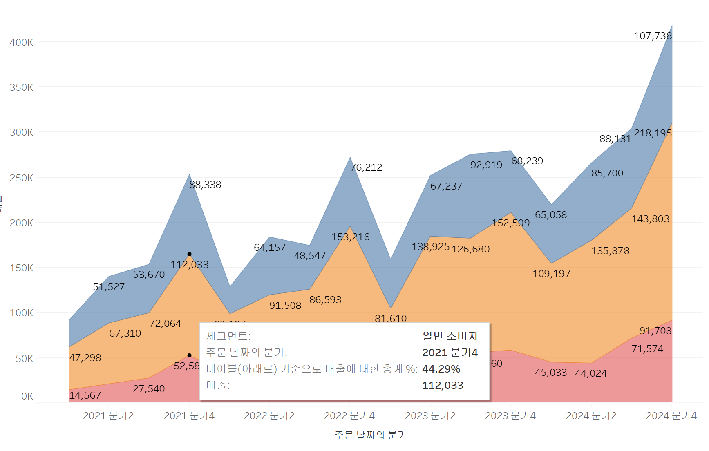

# Third Study Week

- 20강: [파이와 도넛차트](#20강-파이와-도넛차트)

- 21강: [워드와 버블차트](#21강-워드와-버블차트)

- 22강: [이중축과 결합축](#22강-이중축과-결합축)

- 23강: [분산형 차트](#23강-분산형-차트)

- 24강: [히스토그램](#24강-히스토그램)

- 25강: [박스플롯](#25강-박스플롯)

- 26강: [영역차트](#26강-영역차트)

- 27강: [간트차트](#27강-간트차트)

- 28강: [필터](#28강-필터)

- 29강: [그룹](#29강-그룹)


- 문제1 : [문제1](#문제1)

- 문제2 : [문제2](#문제2)

- 참고자료 : [참고자료](#참고-자료)


## Study Schedule

| 강의 범위     | 강의 이수 여부 | 링크                                                                                                        |
|--------------|---------|-----------------------------------------------------------------------------------------------------------|
| 1~9강        |  ✅      | [링크](https://youtu.be/3ovkUe-TP1w?si=CRjj99Qm300unSWt)       |
| 10~19강      | ✅      | [링크](https://www.youtube.com/watch?v=AXkaUrJs-Ko&list=PL87tgIIryGsa5vdz6MsaOEF8PK-YqK3fz&index=75)       |
| 20~29강      | ✅      | [링크](https://www.youtube.com/watch?v=Qcl4l6p-gHM)      |
| 30~39강      | 🍽️      | [링크](https://www.youtube.com/watch?v=e6J0Ljd6h44&list=PL87tgIIryGsa5vdz6MsaOEF8PK-YqK3fz&index=55)       |
| 40~49강      | 🍽️      | [링크](https://www.youtube.com/watch?v=AXkaUrJs-Ko&list=PL87tgIIryGsa5vdz6MsaOEF8PK-YqK3fz&index=45)       |
| 50~59강      | 🍽️      | [링크](https://www.youtube.com/watch?v=AXkaUrJs-Ko&list=PL87tgIIryGsa5vdz6MsaOEF8PK-YqK3fz&index=35)       |
| 60~69강      | 🍽️      | [링크](https://www.youtube.com/watch?v=AXkaUrJs-Ko&list=PL87tgIIryGsa5vdz6MsaOEF8PK-YqK3fz&index=25)       |
| 70~79강      | 🍽️      | [링크](https://www.youtube.com/watch?v=AXkaUrJs-Ko&list=PL87tgIIryGsa5vdz6MsaOEF8PK-YqK3fz&index=15)       |
| 80~89강      | 🍽️      | [링크](https://www.youtube.com/watch?v=AXkaUrJs-Ko&list=PL87tgIIryGsa5vdz6MsaOEF8PK-YqK3fz&index=5)        |


<!-- 여기까진 그대로 둬 주세요-->
<!-- 이 안에 들어오는 텍스트는 주석입니다. -->

# Third Study Week

## 20강: 파이와 도넛차트
<!-- 파이와 도넛차트에 관해 배우게 된 점을 적어주세요 -->  파이차트는 원 모양의 그래프로 주로 비율을 표시하는 것에 유리하다. 파이 차트 중앙에 추가적으로 구멍을 뚫고 원하는 데이터(ex.합계)를 넣어주는 것이 도넛차트이다.


> **🧞‍♀️ 도넛차트를 생성하는 법을 기록해주세요.**
먼저 새로운 열을 만들어서 두 개의 원그래프를 만들어주고 새로운 그래프에 원하는 데이터를 넣어준 다음 두 그래프를 합쳐주고 테두리 등을 제거해서 만들 수 있다.
## 21강: 워드와 버블차트
<!-- 워드와 버블차트에 관해 배우게 된 점을 적어주세요 --> 버블차트는 수치적 데이터를 원의 크기로 표현하는 차트이고 워드크라우드는 문서 내에서 등장하는 키워드가 얼마나 자주 등장하는지 덱스트 크기로 표현한다. 워드 클라우드는 마크에서 텍스트로 변경하여 사용할 수 있고 색상에 매출을 넣어서 색깔로 매출의 크기를 표현할 수 있다.


## 22강: 이중축과 결합축
<!-- 이중축과 결합축에 관해 배우게 된 점을 적어주세요 --> 이중축은 데이터를 오른쪽으로 끌고와서 그래프를 동시에 나타내서 마크 창에서 두가지 축을 따로 다룰 수 있지만 결합된 축은 데이터를 왼쪽으로 끌고와서 적용할 수 있고 마크 창이 하나밖에 없어 결합되어 사용된다.


## 23강: 분산형 차트
<!-- 분산형 차트에 관해 배우게 된 점을 적어주세요 --> 분산형 차트는 그래프에 추세선을 그릴 때 유리한 차트로, 데이터 간의 상관성을 확인해 볼 수 있다. 특히 추세선을 추가해서 각 범주별로 비교해 볼 수 있다.

```js
강의 영상과 달리, 우리 파일에는 '제조 업체' 필드가 없습니다. 필요한 경우, 계산된 필드를 이용해 'SPLIT([제품 이름], ' ', 1)'를 '제조 업체'로 정의하시고 세부 정보에 놓아주세요.
```

## 24강: 히스토그램
<!-- 히스토그램에 관해 배우게 된 점을 적어주세요 --> 히스토그램은 연속형 측정값을 통해 수치데이터의 빈도를 표시하는 양적 데이터이고 막대 그래프는 불연속적 범주를 비교하기 위해 사용되고 막대와 막대 사이에 공백이 존재한다. 히스토그램은 구간차원을 먼저 생성한 후 행에 데이터를 넣어서 하는 방법이 있고 데이터를 먼저 넣고 표현방식을 히스토그램으로 바꿔주는 방시그이 두가지 방법이 있다. 


## 25강: 박스플롯
<!-- 박스플롯에 관해 배우게 된 점을 적어주세요 --> 박스플롯은 데이터의 분포와 이상치를 한번에 볼 수 있는 그래프이다. 1분위수, 2분위수,3분위수,iqr을 사용해서 그린다. 박스플롯은 표현방식에서 박스플롯을 선택해서 그릴 수 있다.


## 26강: 영역차트
<!-- 영역차트에 관해 배우게 된 점을 적어주세요 --> 영역 차트는 라인과 축 사이의 공간이 색상으로 채워진 라인 차트이다. 연속형 데이터의 누계를 보기 위해 사용된다.영역차트는 누계를 보기 때문에 마크에서 구성비율을 활용하여 표시하는 것이 좋다.


## 27강: 간트차트
<!-- 간트차트에 관해 배우게 된 점을 적어주세요 --> 간트 차트는 주로 시간 경과에 따른 기간을 시각화하는데 사용한다. 배송기간 데이터를 만들기 위해 분석 -> 계산된 필드 만들기 기능으로 배송날짜와 주문날짜를 빼서 배송기간 데이터를 만든다. 그 후 필터를 통해 사람 별로 간트차트를 구성할 수 있도록 만들고 하위범주를 행에 추가해주면 된다. 


## 28강: 필터
<!-- 필터에 관해 배우게 된 점을 적어주세요 --> 태블로는 추출, 데이터 원본, 컨텍스트, 차원, 측정값, 필터 순으로 동작한다. 컨텍스트 필터는 필터 중 상위 필터라고 할 수 있고 다른 필터가 컨텍스트 필터에 종속되어 작동한다. 예를 들어 기술 범주의 필터와 제품 이름별 상위 열개의 필터가 있을 때 컨텍스트 필터를 기술에 적용하면 색이 회색으로 바뀌고 가장 상위의 범주에 있게 되어 기술분야의 제품을 먼저 선택하고 그 뒤로 판매 상위 10개를 제시하게 된다. 차원 필드의 와일드 카드에서는 내가 원하는 문자가 있는 필드를 선택할 수 있다. 조건 필드는 필드에 수치적인 조건을 주어 해당하는 필드만 가져올 수 있다. 상위는 상위 n개의 데이터를 가져올 수 있다.

## 29강: 그룹
<!-- 그룹에 관해 배우게 된 점을 적어주세요 --> 그룹을 통해 수동으로 필드에 있는 항목들을 묶을 수 있으며, 기존 데이터 원본에 없는 사용자 지정 그룹 필드를 만들 수 있다. 막대 그래프를 제품별 수익으로 만든 후 회사별로 드래그 해서 그룹을 만드는 방법이 있고 제품이름 -> 만들기 -> 그룹에서 그룹을 선택한 후 만드는 방법이 있다. 그룹화를 하면 화면 왼쪽 데이터에 그룹이 추가되는데 이걸 이용해서 색상 마크에 넣어 시각화할 수 있다.

## 문제 1.

```js
유정이는 superstore 데이터셋에서 '주문' 테이블을 보고 있습니다.
1) 국가/지역 - 시/도- 도시 의 계층을 생성했습니다. 계층 이름은 '위치'로 설정하겠습니다.
2) 날짜의 데이터 타입을 '날짜'로 바꾸었습니다.

코로나 시기의 도시별 매출 top10을 확인하고자
1) 배송 날짜가 코로나시기인 2021년, 2022년에 해당하는 데이터를 필터링했고
2) 위치 계층을 행으로 설정해 펼쳐두었습니다.
이때, 매출의 합계가 TOP 10인 도시들만을 보았습니다.
```


```
겉보기에는 전체 10개로, 잘 나온 결과처럼 보입니다. 그러나 유정이는 치명적인 실수를 저질렀습니다.
오늘 배운 '컨텍스트 필터'의 내용을 고려하여 올바른 풀이 및 결과를 구해주세요.
```

<!-- DArt-B superstore가 아닌 개인 superstore 파일을 사용했다면 값이 다르게 표시될 수 있습니다.--> 연도를 먼저 컨텍스트 필터로 처리해야 2021,2022년의 도시별 합계 상위 10개를 뽑을 수 있는데, 연도를 먼저 필터링 해야 해당 연도로 집계되어 올바를 결과를 얻을 수 있다.

## 문제 2.

```js
태영이는 관심이 있는 제품사들이 있습니다. '제품 이름' 필드에서 '삼성'으로 시작하는 제품들을 'Samsung group'으로, 'Apple'으로 시작하는 제품들을 'Apple group'으로, 'Canon'으로 시작하는 제품들을 'Canon group'으로, 'HP'로 시작하는 제품들을 'HP group', 'Logitech'으로 시작하는 제품들을 'Logitech group'으로 그룹화해서 보려고 합니다. 나머지는 기타로 설정해주세요. 이 그룹화를 명명하는 필드는 'Product Name Group'으로 설정해주세요.

(이때, 드래그보다는 멤버 찾기 > 시작 문자 설정하여 모두 찾아 한번에 그룹화해 확인해보세요.)
```


```js
해당 그룹별로 어떤 국가/지역이 주문을 많이 차지하는지를 보고자 합니다. 매출액보다는 주문량을 보고 싶으므로, 주문Id의 카운트로 계산하겠습니다.

기타를 제외하고 지정한 5개의 그룹 하위 목들만을 이용해 아래와 같이 지역별 누적 막대그래프를 그려봐주세요.
```


1. 제품이름 -> 만들기 -> 그룹을 통해 그룹화
2. 그룹화할 때 포함을 사용해서 samsung, apple등의 기업을 필터링 한 후 각각을 그룹화하여 이름 바꿔주기
3. 필터에 그룹화 한 product name을 넣어주고 기타항목 제거
4. 행은 product name열은 주문 id를 우클릭으로 드래그한 후 카운트(고유)선택
5. 마크의 색상에 국가를 넣어주기