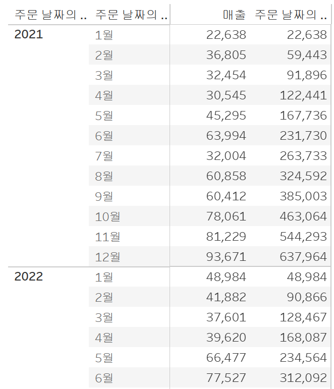

# Fourth Study Week

- 30강: [계층](#30-계층)

- 31강: [집합](#31-집합)

- 32강: [결합집합](#32-결합집합)

- 33강: [계산된 필드](#33-계산된-필드)

- 34강: [행수준계산](#34-행수준계산)

- 35강: [집계계산](#35-집계계산)

- 36강: [테이블계산](#36-테이블계산)

- 37강: [퀵테이블계산(1)](#37-퀵테이블계산1)

- 38강: [퀵테이블계산(2)](#38-퀵테이블계산2)

- [문제1](#문제-1)

- [문제2](#문제-2)

- [문제3](#문제-3)

## Study Schedule

| 강의 범위     | 강의 이수 여부 | 링크                                                                                                        |
|--------------|---------|-----------------------------------------------------------------------------------------------------------|
| 1~9강        |  ✅      | [링크](https://www.youtube.com/watch?v=AXkaUrJs-Ko&list=PL87tgIIryGsa5vdz6MsaOEF8PK-YqK3fz&index=84)       |
| 10~19강      | ✅      | [링크](https://www.youtube.com/watch?v=AXkaUrJs-Ko&list=PL87tgIIryGsa5vdz6MsaOEF8PK-YqK3fz&index=75)       |
| 20~29강      | ✅      | [링크](https://www.youtube.com/watch?v=AXkaUrJs-Ko&list=PL87tgIIryGsa5vdz6MsaOEF8PK-YqK3fz&index=65)       |
| 30~38강      | ✅      | [링크](https://youtu.be/e6J0Ljd6h44?si=nhGbB7GsdOCqj15f)       |
| 39~49강      | 🍽️      | [링크](https://www.youtube.com/watch?v=AXkaUrJs-Ko&list=PL87tgIIryGsa5vdz6MsaOEF8PK-YqK3fz&index=45)       |
| 50~59강      | 🍽️      | [링크](https://www.youtube.com/watch?v=AXkaUrJs-Ko&list=PL87tgIIryGsa5vdz6MsaOEF8PK-YqK3fz&index=35)       |
| 60~69강      | 🍽️      | [링크](https://www.youtube.com/watch?v=AXkaUrJs-Ko&list=PL87tgIIryGsa5vdz6MsaOEF8PK-YqK3fz&index=25)       |
| 70~79강      | 🍽️      | [링크](https://www.youtube.com/watch?v=AXkaUrJs-Ko&list=PL87tgIIryGsa5vdz6MsaOEF8PK-YqK3fz&index=15)       |
| 80~89강      | 🍽️      | [링크](https://www.youtube.com/watch?v=AXkaUrJs-Ko&list=PL87tgIIryGsa5vdz6MsaOEF8PK-YqK3fz&index=5)        |

<!-- 여기까진 그대로 둬 주세요-->

> **🧞‍♀️ 오늘의 스터디는 지니와 함께합니다.**


## 30. 계층

<!-- 계층 구조와 관련된 개념, 사용 방법 등을 적어주세요. --> 계층은 뷰에서 데이터를 드릴다운하여 값을 세부적으로 찾을 때 유용한 방법이다. 예를 들어 열 선반에 배송날짜를 올리면 +를 눌러서 년, 분기, 월 데이터를 조회할 수 있다. 계층은 계층을 만들고 싶은 데이터를 선택하고 계층만들기를 통해 만들 수 있다.

## 31. 집합

<!-- 집합의 정의 및 활용 방법에 대해 알게 된 점을 적어주세요. --> 집합은 사용자가 직접 조건을 선택하고 그 조건을 기반으로 데이터들을 구분하는 방법이다.집합은 데이터 선택 후 집합 만들기를 클릭하여 만들 수 있고 집합에는 일반, 조건, 상위가 있으며 상위를 통해 상위 10개의 지역을 뽑아낼 수 있다.(ex수익 상위 10개 도시)

## 32. 결합집합

<!-- 결합집합의 개념 및 사용 사례를 적어주세요. -->결합된 집합은 말 그대로 두 개의 집합을 만든 후 두개의 집합을 결합하는 기능이다. 두 집합을 만든 후 두 집합의 합집합, 교집합, 차집합을 선택해서 결합된 집합을 만들 수 있으며 마크의 색상을 통해 표시할 수 있다.


## 33. 계산된 필드

<!-- 계산된 필드를 사용하는 방법과 예시를 적어주세요. --> 계산된 필드는 데이터 패널을 통해 생성하는 방법과 분석 탭을 통해 생성하는 방법, 사용하고자 하는 필드에 마우스 우클릭해서 만드는 방법이 있다. 다양한 함수 목록을 오른쪽에서 확인할 수 있고 예시도 제시되어 있다. 필드는 드래그 앤 드롭해서 가져오는 방법이 있고 직접 입력하는 방법이 있다. 문자는 따옴표 안에 넣으면 되고 주석은 //를 입력한 후 넣으면 된다.


## 34. 행수준계산

<!-- 행수준 계산의 의미와 적용 방법을 적어주세요. --> 계산된 테이블에는 기본 계산, 테이블 계산, LOD표현식이 있다. 기본계산은 데이터 원본에 대한 행 수준 계산 또는 집계 계산이다. 행 수준 계산은 각 행별로 계산을 하며 행 수준으로 계산했을 때 한 항목에 여러 요소가 있을 때 한꺼번에 계산될 수 있으므로 차원으로 바꾸어 주어야 한다.


## 35. 집계계산

<!-- 집계계산의 정의 및 활용 사례에 대해 알게 된 점을 적어주세요. --> 태블로는 기본적으로 행에 드래그 앤 드롭하면 썸 함수가 적용되지만 기본속성->집계를 통해 선택할 수 있다.사용자가 집계계산 필드를 만들면 마우스 우클릭으로 변경할 수가 없다. 예를 들어 연도별 주문 건수를 알고 싶을 때 집계계산을 통해 주문ID를 카운트하여 나타낼 수 있다.


## 36. 테이블계산

<!-- 테이블 계산의 개념 및 사용 방법을 적어주세요. --> 
테이블 계산은 뷰에 보이는 내용을 바탕으로 데이터가 계산된다. 테이블 계산 방향을 우클릭해서 옆으로나 아래로 지정하여 원하는 방향으로 계산할 수 있다.
 

## 37. 퀵테이블계산(1)

<!-- 퀵테이블 계산의 원리 및 예제에 대해 알게 된 점을 적어주세요. --> 테이블 계산에서 가장 자주 쓰이는 테이블 계산 유형들을 클릭만으로 가능하게 한 것이 퀵테이블 계산이다. 데이터를 우클릭 후 퀵테이블 계산을 클릭하면 된다. 퀵테이블 계산에서 차이는 기본적으로 이전값고 비교하며 옵션에서 선택할 수 있다.비율 차이는 측정값들 사이의 성장률 또는 %차이를 표현한다. 퀵 테이블 계산은 데이터를 측정값으로 가져온 후 우클릭을 통해 계산하는것이 가장 편리하고 다음을 사용하여 계산에서 계산 방향을 목적에 맞게 변경해주어야 한다.


## 38. 퀵테이블계산(2)

<!-- 이동평균, YTD 총계, 전년 대비 성장률, YTD 성장률 등 본 강의에서 알게 된 점을 적어주세요. --> - - - 이동평균은 이전의 값부터 현재까지 값에 대한 평균을 낼 때 사용하여 주식에서 많이 사용된다.

- YTD는 특정 시점을 기준으로 해당 연도부터 그 시점까지의 총계를 말한다.

- 전년 대비 성장률은 같은 월로 했을 때 이전 년도 대비 얼마나 성장했는지 나타내는 지표
## 문제 1.

규석이는 이제껏 매출을 올리는 데에 힘썼었지만, 왠지 모르게 주머니에 들어오는 돈이 없어 속상합니다. 

그래서 매출이 상위 20곳에 속하지만, 수익률(%)이 마이너스인 시/도를 확인하려고 합니다.

> 수익률은 SUM([수익]) / SUM([매출])로 정의합니다.

어떤 집합을 만들었고, 어떤 결합을 하였는지를 중심으로 기술하고, 결과 자료를 첨부해주세요. 

(텍스트 표 형태이며, 색상으로 위 집합을 구분할 수 있게 만들어주세요.)

<!-- 아래 예시 이미지를 삭제하고, 직접 만든 시트 사진을 올려주세요. 시트의 이름은 본인 이름으로 기입해주세요-->


집합은 매출상위 20개인 집합과 수익률이 음수인 집합 2개를 만들었고 결합된 집합을 만들어서 교집합을 선택하여 집합을 새로 만들었다. 그 후 마크의 색상에 넣어주어 표시해 주었다.


## 문제 2.
선희는 주문 Id별로 주문에서 배송까지에 걸리는 날짜 일수가 궁금했습니다. 
그래서 주문 ID별로 주문에서 배송까지 걸리는 일자를 '배송까지 걸린 일수'라는 계산된 필드로 만들고, 이를 마크에 올린 후 확인해보았습니다. 
이때, 계산된 필드의 식은 'DATEDIFF' 함수를 이용하였습니다.

배송까지 걸린 일수 계산을 위한 DATEDIFF 함수 수식을 적어주세요.

```
DATEDIFF('day', [주문날짜], [배송날짜])

```


그런데 위 그림처럼 '주문 날짜'와 '배송 날짜'를 함께 행에 올려 확인해보니, 주문날짜와 배송날짜의 차이가 '배송까지 걸린 일수'와 다릅니다.

ID-2021-11126을 보니, 11월 26일 배송에 11월 30일 배송이면 4일 차이인데, 12일이 걸렸다고 하네요. 왜 이런 문제가 생긴걸까요?

```
같은 아이디에 주문이 여러 개 있는 경우 주문 별로 날짜 차이를 더하기 때문에 12일이 걸렸다는 결과가 나온다.
```

그리고 이를 해결하기 위해서는 어떻게 해야 할까요?

```
데이터를 차원으로 바꾸어 주어 합쳐져있는 데이터를 풀어준다.
```


## 문제 3.

다음은 Tableau의 다양한 계산을 사용할 수 있는 경우를 빈칸으로 두고 문제를 작성한 것입니다. 각 빈칸에 적합한 계산 유형을 채워보세요.

보기
> **누계, 차이, 비율 차이, 구성 비율, 순위, 백분위수, 이동 평균, YTD 총계, 통합 성장률, 전년 대비 성장률, YTD 성장률**

| 계산 유형               | 설명                                                                 | 사용 예시                                                                                          |
|-------------------------|----------------------------------------------------------------------|-----------------------------------------------------------------------------------------------------|
| 누적        | 데이터의 누적 합계를 계산                                             | 한 기업이 월별 매출 데이터를 누적하여 연간 매출 추이를 보고 싶을 때 사용                                      |
| 차이         | 연속 데이터 포인트 간의 차이를 계산                                    | 한 기업이 월별 매출 데이터에서 전월 대비 매출 증감량을 분석하고 싶은 경우                                        |
|비율차이         | 연속 데이터 포인트 간의 비율 변화를 계산                               | 한 기업이 월별 매출 데이터에서 전월 대비 매출 증감률(%)을 분석하고 싶은 경우                                      |
| 구성 비율     | 전체에서 각 데이터 포인트의 비율을 계산                                | 한 기업이 전체 매출에서 각 제품군이 차지하는 비율을 보고 싶을 때 사용                                           |
| 순위         | 데이터의 순위를 매깁니다                                              | 한 기업이 제품별 매출 데이터를 순위별로 정렬하여 상위 10개 제품을 분석하고 싶은 경우                              |
| 백분위수        | 데이터의 백분위를 계산                                               | 한 기업이 고객별 구매 금액 데이터를 백분위수로 나누어 상위 25% 고객을 분석하고 싶은 경우                          |
| 이동평균         | 일정 기간의 평균을 계산                                               | 한 기업이 주간 매출 데이터에서 4주 이동 평균을 계산하여 트렌드를 분석하고 싶은 경우                              |
| YTD 총계   | 연초부터 현재까지의 총계를 계산                                      | 한 기업이 월별 매출 데이터를 연초부터 현재까지 누적하여 연간 매출 목표 달성 여부를 분석하고 싶은 경우             |
| 연평균 성장률        | 일정 기간 동안의 연평균 성장률을 계산                                  | 한 기업이 5년 간 매출 데이터를 바탕으로 연평균 성장률(CAGR)을 계산하고 싶은 경우                                  |
| 전년 대비 성장률     | 전년 동기간 대비 성장률을 계산                                        | 한 기업이 월별 매출 데이터에서 전년 동월 대비 매출 성장률을 분석하고 싶은 경우                                    |
| YTD 성장률       | 연초부터 현재까지의 성장률을 계산                                     | 한 기업이 올해 연초부터 현재까지의 매출이 전년 동기 대비 얼마나 성장했는지 분석하고 싶은 경우                     |

> 사용 예시를 참고하여 실제 경우처럼 생각하며 고민해보아요!