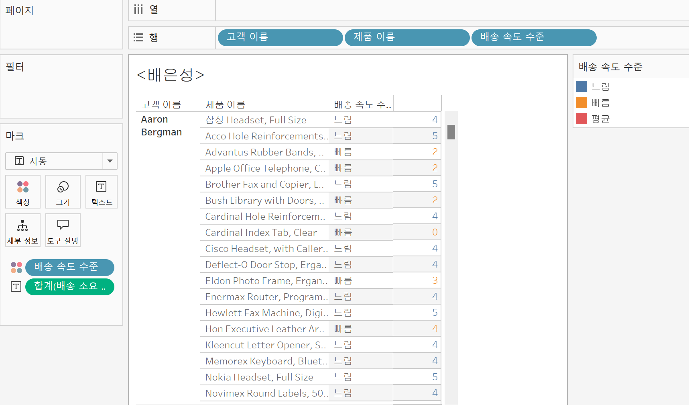

# Fifth Study Week

- 39강: [LOD](#39강-lod)

- 40강: [EXCLUDE](#40-lod-exclude)

- 41강: [INCLUDE](#41-lod-include)

- 42강 : [매개변수](#42-매개변수)

- 43강 : [매개변수 실습](#43-매개변수-실습) 


- 44강: [매개변수 실습](#44-매개변수-실습)

- 45강: [마크카드](#45-워크시트-마크카드)

- 46강: [서식계층](#46-서식-계층)

- 47강: [워크시트](#47-워크시트-서식)

- [문제1](#문제-1)

- [문제2](#문제-2)

## Study Schedule

| 강의 범위     | 강의 이수 여부 | 링크                                                                                                        |
|--------------|---------|-----------------------------------------------------------------------------------------------------------|
| 1~9강        |  ✅      | [링크](https://www.youtube.com/watch?v=AXkaUrJs-Ko&list=PL87tgIIryGsa5vdz6MsaOEF8PK-YqK3fz&index=84)       |
| 10~19강      | ✅      | [링크](https://www.youtube.com/watch?v=AXkaUrJs-Ko&list=PL87tgIIryGsa5vdz6MsaOEF8PK-YqK3fz&index=75)       |
| 20~29강      | ✅      | [링크](https://www.youtube.com/watch?v=AXkaUrJs-Ko&list=PL87tgIIryGsa5vdz6MsaOEF8PK-YqK3fz&index=65)       |
| 30~38강      | ✅      | [링크](https://www.youtube.com/watch?v=e6J0Ljd6h44&list=PL87tgIIryGsa5vdz6MsaOEF8PK-YqK3fz&index=55)       |
| 39~47강      | ✅      | [링크](https://www.youtube.com/watch?v=AXkaUrJs-Ko&list=PL87tgIIryGsa5vdz6MsaOEF8PK-YqK3fz&index=45)       |
| 48~59강      | 🍽️      | [링크](https://www.youtube.com/watch?v=AXkaUrJs-Ko&list=PL87tgIIryGsa5vdz6MsaOEF8PK-YqK3fz&index=35)       |
| 60~69강      | 🍽️      | [링크](https://www.youtube.com/watch?v=AXkaUrJs-Ko&list=PL87tgIIryGsa5vdz6MsaOEF8PK-YqK3fz&index=25)       |
| 70~79강      | 🍽️      | [링크](https://www.youtube.com/watch?v=AXkaUrJs-Ko&list=PL87tgIIryGsa5vdz6MsaOEF8PK-YqK3fz&index=15)       |
| 80~89강      | 🍽️      | [링크](https://www.youtube.com/watch?v=AXkaUrJs-Ko&list=PL87tgIIryGsa5vdz6MsaOEF8PK-YqK3fz&index=5)        |


<!-- 여기까진 그대로 둬 주세요-->

> **🧞‍♀️ 오늘의 스터디는 지니와 함께합니다.**


## 39강. LOD

<!-- INCLUDE, EXCLUDE, FIXED 등 본 강의에서 알게 된 LOD 표현식에 대해 알게 된 점을 적어주세요. --> LOD는 level of detail의 줄임말로 뷰의 세부수준을 나타낸다. fixed에서 설정한 차원이 뷰에 포함되는 포함되지 않든 계산된 필드 만들기에서 'fixed{범주};sum(매출)'를 입력해 만들 수 있다. 


## 40. LOD EXCLUDE

<!-- INCLUDE, EXCLUDE, FIXED 등 본 강의에서 알게 된 LOD 표현식에 대해 알게 된 점을 적고, 아래 두 질문에 답해보세요 :) -->

> **🧞‍♀️ FIXED와 EXCLUDE을 사용하는 경우의 차이가 무엇인가요?**

```
exclude는 현재 뷰에서 특정 차원을 제외하여 계산할 때 사용하는 것이고 fixed는 차원을 고정하기 위해 사용한다. 예를 들어 하위범주를 나타내면 fixed를 사용했을 경우에는 값이 변경되지 않지만 exclude는 뷰에 있는 차원을 따라 계산하기 때문에 필터의 영향을 받는다.
``` 

> **🧞‍♀️ 왜 ATTR 함수를 사용하나요?**

```
ATTR은 뷰에 표시된 차원에 따라 데이터가 여러 행으로 나뉠 때 특정 필드의 고유한 값을 유지하려고 할 때 사용하는데, 영상에서는 exclude 하위 범주 매출의 고유한 값을 유지하기 위해 사용했다.
```


## 41. LOD INCLUDE

<!-- INCLUDE, EXCLUDE, FIXED 등 본 강의에서 알게 된 LOD 표현식에 대해 알게 된 점을 적고, 아래 두 질문에 답해보세요 :) --> include lod는 현재 차원에 특정 차원을 추가하여 계산한다. exclude의 경우와 같이 필터를 통해 값을 변경할 수 있다.


> **🧞‍♀️ 그렇다면 어떤 경우에 각 표현식을 사용하나요? 예시와 함께 적어보아요**


```
fixed 표현식은 말 그대로 항상 지정된 차원에 따라 데이터를 집계하고 싶을 때 사용하는데, 뷰에 다른 필드가 추가되더라도 영향을 받지 않고 싶을 때 사용한다. include와 exclude는 차원의 영향을 받는데, include는 데이터에서 sub-catogory까지 집계하고 싶을 때 더 세분화된 매출을 보고싶을 때 사용하고, exclude는 특정 차원을 제외하고 집계하고 싶을 때 사용하는데, 예를 들어 sub-category를 제외하고 집계하고 싶을 때 사용할 수 있다.
```

## 42. 매개변수

<!-- 매개변수에 대해 알게 된 점을 적어주세요 --> 매개변수는 고정된 상수값이 아닌 동적인 값으로 변경하기 위해서 사용하는 기능으로 계산식, 필터, 참조선이 필요하다. 매개변수를 만들고 꼭 필터에서 만든 매개변수로 변경을 해주어야 적용이 된다.


> **🧞‍♀️ 집합에도 매개변수를 적용할 수 있나요? 시도해봅시다** 집합에 매개변수를 적용하여 마크카드의 색상위에 넣으면 상위5개 필드를 시각화할 수 있다.


## 43. 매개변수 실습
<!-- 영상 묶음에 포함되지 않아 찾기 어려우실까 링크를 아래에 첨부하겠습니다. 수강 후 삭제해주세요-->

매개변수를 작동시키기 위해서는 계산된 필드가 필요하고 시트의 제목을 매개변수 값에 따라 달라지도록 하면 어떤 매개변수가 사용되고 있는지 알기 편하다.또한 매개변수를 측정값으로 지정할 수도 있다.

## 44. 매개변수 실습

<!-- 매개변수에 대해 알게 된 점을 적어주세요 -->
매개변수 중 참조선을 만드는 것이 있는데 목표 매출을 표시할 때 사용할 수 있다. 그 후 계산된 필드를 만들어 목표매출 보다 크거나 작은 경우를 구분하여 마크의 색상에 넣으면 목표매출을 달성했는지 구분해볼 수 있다. 참조선을 만들때는 참조 구간을 뷰로 드래그 해주어야 한다.

## 45. 워크시트 마크카드

<!-- 마크카드에 대해 알게 된 점을 적어주세요 --> 태블로에서 차트 안에 있는 데이터들을 마크라고 하는데 
마크의 서식들을 변경하기 위해선 마크카드를 사용해햐 한다. 마크에서 색상을 통해 구분할 수 있는데 연속형 데이터는 크면 클수록 색이 진해지도록 하고 범주형 데이터는 범주별로 색상을 선택할 수 있다. 크기에서는 마크의 크기를 조절할 수 있다.
마크의 레이블 편집에서는 어떤 데이터를 레이블로 표시할 것인지, 어떤 색상을 선택할 것인지 정할 수 있다. 세부 정보는 차트에서 데이터별로 정보를 표시하고자 할 때 사용한다. 연속형 데이터이면 마우스를 데이터 위에 위치하면 데이터의 세부정보가 표시된다(도구설명). 모양에서는 마크의 도형을 바꿀 수 있다.

## 46. 서식 계층

<!-- 서식계층에 대해 알게 된 점을 적어주세요 --> 서식 에는 글꼴, 맟춤, 음영, 테두리, 라인 등의 서식이 있다. 행 서식은 워크 시트 서식보다 더 하위 계층이기 때문에 워크 시트 서식을 바꾸어도 행 서식은 변경되지 않는다.

> **🧞‍♀️ 서식계층을 일반적인 것에서 구체적인 것 순서로 기입해보세요** 일반적인 것부터 구체적인 것 순으로 설명을 하자면 워크 시트 서식, 행/열 서식, 특정 필드, 필드 레이블, 도구설명/제목/마크 순으로 구성되어 있다.


```
일반적인 것부터 구체적인 것 순으로 설명을 하자면 워크 시트 서식, 행/열 서식, 특정 필드, 필드 레이블, 도구설명/제목/마크 순으로 구성되어 있다.
```


## 47. 워크시트 서식

<!-- 워크시트 서식에 대해 알게 된 점을 적어주세요!--> 
글꼴은 워크시트에 있는 글자들의 글꼴과 색상을 정할 수 있다. 또한 총계와 같은 값들은 다른 색으로 지정할 수 있다. 음영은 데이터 셀의 음영을 줄 수 있다. 음영 옵션을 통해 어둡거나 밝게 데이터셀을 조정할 수 있다.


## 문제 리스트


## 문제 1.

```
가장 많이 주문한 사람들은 물건 배송을 빨리 받았을까요?
조건을 준수하여 아래 이미지를 만들어봆시다.
1) 국가/지역별(이하 '나라'로 통칭), 범주별로 배송일자가 다를 수 있으니 먼저, 나라별/범주별로 평균 배송일자를 설정한 뒤,
2) 각 나라에서 가장 많이 주문한 사람의 이름을 첫 번째 열,
3) 그 사람이 주문한 제품 이름을 2번째 열,
4) 각 상품이 배송까지 걸린 날 수를 표현하고
5) 그리고 만약 배송이 각 나라/범주별 평균보다 빨랐다면 '빠름', 같다면 '평균', 느리다면 '느림' 으로 print 해주세요. 
```


<!-- 여기까지 오는 과정 중 알게 된 점을 기입하고, 결과는 시트 명을 본인 이름으로 바꾸어 표시해주세요.-->


1.
```tableau
{FIXED [국가], [범주]: AVG(DATEDIFF('day', [주문일자], [배송일자]))}
```
fixed식을 사용하여 국가별/범주별 평균 배송일 계산

2. 
```tableau
DATEDIFF('day', [주문일자], [배송일자])
```
각 제품의 배송 소요일자 계산

3. 
```tableau
IF DATEDIFF('day', [주문일자], [배송일자]) < {FIXED [국가], [범주]: AVG(DATEDIFF('day', [주문일자], [배송일자]))} THEN '빠름'
ELSEIF DATEDIFF('day', [주문일자], [배송일자]) = {FIXED [국가], [범주]: AVG(DATEDIFF('day', [주문일자], [배송일자]))} THEN '평균'
ELSE '느림'
END
```
제품의 평균 배송일자와 배송 소요 시간을 비교해서 배송속도 수준 필드 생성

4.
색상에는 배송속도 수준, 텍스트에는 배송 소요 일자를 마크에 넣어주어 완성


## 문제 2.

```
채원이는 태블로를 쓰실 수 없는 상사분께 보고하기 위한 대시보드를 만들고 싶어요. 

제품 중분류별로 구분하되 매개변수로써 수익, 매출, 수량을 입력하면 저절로 각각 지표에 해당하는 그래프로 바뀌도록 설계하고자 해요.

 어떤 값이 각 지표의 평균보다 낮은 값을 갖고 있다면 색깔을 주황색으로, 그것보다 높다면 파란색으로 표시하고 싶어요. 그 평균값은 각 지표별로 달라야 해요.
```


<!-- 예시 사진은 지워주세요-->